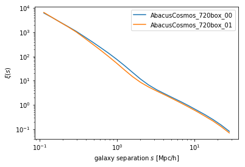

# Overview
We provide example Python 3 code to load the FoF and Rockstar halo catalogs and particle subsamples.
The main file is [Halos.py](https://github.com/lgarrison/AbacusCosmos/blob/master/AbacusCosmos/Halos.py);
we also provide [Halotools.py](https://github.com/lgarrison/AbacusCosmos/blob/master/AbacusCosmos/Halotools.py),
which is a thin wrapper around `Halos.py`
that puts the catalogs in [halotools](http://halotools.readthedocs.io/) format, where HODs can easily be applied.

All the code is available on the [AbacusCosmos GitHub](https://github.com/lgarrison/AbacusCosmos).
Please file an issue there if you find a problem with the code.

Using these interfaces is not necessary; all of the data formats are documented in
[Data Specifications]({{ site.baseurl }}).  But the example
code might help you get started using the catalogs faster or help with implementing your own
code to parse the catalogs.

The generally recommended usage is to clone the repository and add it to your `PYTHONPATH` environment variable.
This will allow you to import AbacusCosmos from anywhere.  Typically, this will involve
placing a command like the following in your `~/.bashrc` file:
```bash
export PYTHONPATH="/path/to/AbacusCosmos/:$PYTHONPATH"
```

[Yuan, Eisenstein, & Garrison](https://arxiv.org/abs/1802.10115) has also developed a decorated HOD package called GRAND-HOD that incorporates multiple HOD generalizations, such as assembly bias and velocity bias.  The [GRAND-HOD](https://github.com/SandyYuan/GRAND-HOD) repository contains details on its usage and code examples.

# Examples
The following examples are adapted from [this Jupyter notebook](https://github.com/lgarrison/AbacusCosmos/blob/master/AbacusCosmos_Python_Interface_Examples.ipynb).

<div markdown="1" class="jupyternb">
## [Halos.py](https://github.com/lgarrison/AbacusCosmos/blob/master/AbacusCosmos/Halos.py)


```python
from AbacusCosmos import Halos

import matplotlib.pyplot as plt
%matplotlib inline
import numpy as np
```

    /home/lgarrison/anaconda3/lib/python3.6/site-packages/h5py/__init__.py:36: FutureWarning: Conversion of the second argument of issubdtype from `float` to `np.floating` is deprecated. In future, it will be treated as `np.float64 == np.dtype(float).type`.
      from ._conv import register_converters as _register_converters


### Load a single halo Rockstar catalog with particle subsamples:


```python
# The path to the catalog will be different on your system
cat = Halos.make_catalog_from_dir(dirname='/mnt/gosling2/bigsim_products/AbacusCosmos_1100box_products/AbacusCosmos_1100box_00_products/AbacusCosmos_1100box_00_rockstar_halos/z0.300',
                                  load_subsamples=True, load_pids=False)
halos = cat.halos
halo_1000 = halos[1000]
subsamples = cat.subsamples
```


```python
for field in sorted(halo_1000.dtype.fields):
    print(field, ':', halo_1000[field])
```

    A : [53.04891   5.399098 -9.398761]
    A2 : [39.850292  6.907639 -7.766779]
    J : [-1.9693516e+13  2.7946513e+13 -1.4426672e+13]
    N : 155
    N_SO : 983
    Voff : 29.62147
    Xoff : 22.592842
    alt_N : [135 121  91  29]
    alt_N_SO : [983 983 983  48]
    alt_m : [5.0370770e+12 4.5147137e+12 3.3953630e+12 1.0820388e+12]
    alt_m_SO : [3.6677385e+13 3.6677385e+13 3.6677385e+13 1.7909607e+12]
    b_to_a : 0.46212736
    b_to_a2 : 0.38154382
    bulkvel : [ -663.75305    93.82869 -1657.28   ]
    bullock_spin : 0.07133085
    c_to_a : 0.33044723
    c_to_a2 : 0.27497157
    child_r : 0.43996406
    corevel : [ -682.8728    108.45962 -1700.5497 ]
    desc : 0
    energy : -9.7564e+16
    flags : 25
    halfmass_radius : 154.01212
    id : 298710
    kin_to_pot : 0.7260747
    klypin_rs : 49.53651
    m : 5783311000000.0
    m_SO : 36677385000000.0
    m_pe_b : 5295078600000.0
    m_pe_d : 3507298200000.0
    mgrav : 4775895600000.0
    min_bulkvel_err : 984.3729
    min_pos_err : 0.00025078392
    min_vel_err : 1050.1628
    n_core : 98
    num_child_particles : 206
    num_p : 206
    p_start : 73900406
    parent_id : 298727
    pos : [426.93628   15.228214 237.38449 ]
    r : 375.43213
    rs : 55.43358
    rvmax : 237.90572
    spin : 0.054060824
    subsamp_len : 18
    subsamp_start : 40967
    vel : [ -682.8728    108.45962 -1700.5497 ]
    vmax : 303.44504
    vmax_r : 0.43149778
    vrms : 326.53113


The subsample particles should be near the halo location of `[426.93628   15.228214 237.38449 ]`, and indeed they are:


```python
particles_for_halo_1000 = subsamples[halo_1000['subsamp_start']:halo_1000['subsamp_start']+halo_1000['subsamp_len']]
print(particles_for_halo_1000['pos'])
```

    [[426.9143     15.245714  237.90285  ]
     [427.37714    15.368571  237.59572  ]
     [427.23428    15.095714  237.58429  ]
     [426.94427    15.0671425 237.53714  ]
     [426.8857     15.225714  237.47571  ]
     [426.9057     15.158571  237.44286  ]
     [426.75427    15.267143  237.44142  ]
     [427.12286    15.108572  237.42     ]
     [427.1643     15.288571  237.35858  ]
     [426.79858    15.330001  237.34572  ]
     [426.9586     15.265714  237.34143  ]
     [426.9943     15.207143  237.32713  ]
     [426.67285    15.554285  237.28142  ]
     [426.94858    15.187143  237.28     ]
     [427.09717    15.387142  237.17857  ]
     [426.53857    15.372857  237.11143  ]
     [426.64716    15.35      236.78427  ]
     [427.06       15.085714  236.72856  ]]


### Filter out subhalos:

Note that the above halo is actually a subhalo since its `parent_id` is not `-1`.  Let's see what fraction of Rockstar halos are actually subhalos:


```python
(halos['parent_id'] != -1).mean()
```


    0.09474006531180443


So about 10% are subhalos.  For some analyses you might want to only include top-level parent halos, since Rockstar halo masses always include substructure mass:


```python
print('# halos before subhalo filtering:', len(halos))
halos = halos[halos['parent_id'] == -1]
print('# halos after subhalo filtering:', len(halos))
```

    # halos before subhalo filtering: 9565499
    # halos after subhalo filtering: 8659263


### Load all redshifts of a FoF catalog:


```python
cats_by_z = Halos.make_catalogs(sim_name='emulator_1100box_planck_00',
                                products_dir='/mnt/gosling2/bigsim_products/emulator_1100box_planck_products/',
                                redshifts='all', load_phases=False, load_subsamples=False, halo_type='FoF')
```

We can plot the evolution of the halo mass function with redshift:


```python
fig, ax = plt.subplots()
for z in sorted(cats_by_z.keys()):
    cat = cats_by_z[z]
    bin_edges, bin_centers, hist = Halos.halo_mass_hist(cat.halos[0]['N'])
    ax.loglog(bin_centers, hist, label='$z = {:.2f}$'.format(z))
ax.set_xlabel('Halo mass [# of particles]')
ax.set_ylabel('Number of halos')
ax.legend()
```


    <matplotlib.legend.Legend at 0x7fe5c60e2ba8>


## [Halotools.py](https://github.com/lgarrison/AbacusCosmos/blob/master/AbacusCosmos/Halotools.py)


```python
from AbacusCosmos import Halotools
import halotools

import matplotlib.pyplot as plt
%matplotlib inline
import numpy as np
```

### Load two different cosmologies at redshift 0.1:


```python
cats = Halotools.make_catalogs(sim_name='AbacusCosmos_720box', cosmologies=[0,1], redshifts=0.1,
                                products_dir='/mnt/gosling2/bigsim_products/AbacusCosmos_720box_products/',
                                phases=None, halo_type='Rockstar', load_halo_ptcl_catalog=False)
```

Generate mock galaxy catalogs for both:


```python
for cat in cats:
    # First apply an arbitrary mass cut to make the example run faster
    cat.halo_table = cat.halo_table[cat.halo_table['halo_N'] >= 100]
    # Make an approximate concentration column for mock purposes
    cat.halo_table['halo_conc'] = cat.halo_table['halo_rvir'] / cat.halo_table['halo_klypin_rs']
```


```python
from halotools.empirical_models import PrebuiltHodModelFactory
models = []
for cat in cats:
    model = PrebuiltHodModelFactory('zheng07', redshift=cats[0].redshift, concentration_key='halo_conc')
    model.populate_mock(cat)
    models += [model]
```

Compute the 2PCF on the mock galaxies:


```python
import Corrfunc
bins = np.logspace(-1,1.5,25)
bin_centers = (bins[:-1] + bins[1:])/2.
tpcfs = []
for model in models:
    gals = model.mock.galaxy_table
    results = Corrfunc.theory.xi(X=gals['x'], Y=gals['y'], Z=gals['z'],
                            boxsize=model.mock.BoxSize, nthreads=4,
                            binfile=bins)
    tpcfs += [results]
```


```python
plt.loglog(bin_centers, tpcfs[0]['xi'], label=cats[0].SimName)
plt.loglog(bin_centers, tpcfs[1]['xi'], label=cats[1].SimName)
plt.legend()
plt.xlabel(r'galaxy separation $s$ [Mpc/h]')
plt.ylabel(r'$\xi(s)$')
```


    Text(0,0.5,'$\\xi(s)$')





### Print the particle subsamples for the 1000th halo in the second cosmology:


```python
cats = Halotools.make_catalogs(sim_name='AbacusCosmos_720box', cosmologies=[0,1], redshifts=0.1,
                                products_dir='/mnt/gosling2/bigsim_products/AbacusCosmos_720box_products/',
                                phases=None, halo_type='Rockstar', load_halo_ptcl_catalog=True)
```


```python
halos = cats[1].halo_table
subsamples = cats[1].halo_ptcl_table
i = 999
```


```python
halos[i]
```


&lt;Row index=999&gt;
<table id="table140628049882248">
<thead><tr><th>halo_id</th><th>halo_corevel [3]</th><th>halo_bulkvel [3]</th><th>halo_m_SO</th><th>halo_child_r</th><th>halo_vmax_r</th><th>halo_mgrav</th><th>halo_vmax</th><th>halo_rvmax</th><th>halo_rs</th><th>halo_klypin_rs</th><th>halo_vrms</th><th>halo_J [3]</th><th>halo_energy</th><th>halo_spin</th><th>halo_alt_m [4]</th><th>halo_alt_m_SO [4]</th><th>halo_Xoff</th><th>halo_Voff</th><th>halo_b_to_a</th><th>halo_c_to_a</th><th>halo_A [3]</th><th>halo_b_to_a2</th><th>halo_c_to_a2</th><th>halo_A2 [3]</th><th>halo_bullock_spin</th><th>halo_kin_to_pot</th><th>halo_m_pe_b</th><th>halo_m_pe_d</th><th>halo_halfmass_radius</th><th>halo_num_p</th><th>halo_num_child_particles</th><th>halo_p_start</th><th>halo_desc</th><th>halo_flags</th><th>halo_n_core</th><th>halo_subsamp_start</th><th>halo_subsamp_len</th><th>halo_min_pos_err</th><th>halo_min_vel_err</th><th>halo_min_bulkvel_err</th><th>halo_N</th><th>halo_alt_N [4]</th><th>halo_N_SO</th><th>halo_alt_N_SO [4]</th><th>halo_mvir</th><th>halo_rvir</th><th>halo_x</th><th>halo_y</th><th>halo_z</th><th>halo_vx</th><th>halo_vy</th><th>halo_vz</th><th>halo_upid</th><th>halo_hostid</th></tr></thead>
<thead><tr><th>int64</th><th>float32</th><th>float32</th><th>float32</th><th>float32</th><th>float32</th><th>float32</th><th>float32</th><th>float32</th><th>float32</th><th>float32</th><th>float32</th><th>float32</th><th>float32</th><th>float32</th><th>float32</th><th>float32</th><th>float32</th><th>float32</th><th>float32</th><th>float32</th><th>float32</th><th>float32</th><th>float32</th><th>float32</th><th>float32</th><th>float32</th><th>float32</th><th>float32</th><th>float32</th><th>int64</th><th>int64</th><th>int64</th><th>int64</th><th>int64</th><th>int64</th><th>int64</th><th>int64</th><th>float32</th><th>float32</th><th>float32</th><th>int32</th><th>int32</th><th>int32</th><th>int32</th><th>float32</th><th>float32</th><th>float32</th><th>float32</th><th>float32</th><th>float32</th><th>float32</th><th>float32</th><th>int64</th><th>int64</th></tr></thead>
<tr><td>569976</td><td>-152.74799 .. -599.93256</td><td>-152.74799 .. -599.93256</td><td>9653903000000.0</td><td>0.00027807892</td><td>0.26705223</td><td>918326100000.0</td><td>195.09929</td><td>0.034244202</td><td>0.013399579</td><td>0.013399579</td><td>203.21617</td><td>-592084000000.0 .. 550002360000.0</td><td>-7822789500000000.0</td><td>0.02085905</td><td>918326100000.0 .. 390288570000.0</td><td>9653903000000.0 .. 528037500000.0</td><td>13.82113</td><td>18.201519</td><td>0.6558509</td><td>0.51455605</td><td>-1.9109313 .. 25.46689</td><td>0.9471713</td><td>0.59796464</td><td>14.867451 .. -12.681051</td><td>0.023405345</td><td>0.7082647</td><td>1339113500000.0</td><td>390288570000.0</td><td>0.059088998</td><td>207</td><td>207</td><td>32769850</td><td>0</td><td>25</td><td>53</td><td>50850</td><td>17</td><td>4.5048728e-05</td><td>751.38617</td><td>751.38617</td><td>126</td><td>80 .. 34</td><td>841</td><td>841 .. 46</td><td>1446363500000.0</td><td>0.20255421</td><td>31.882689</td><td>45.794632</td><td>145.67741</td><td>-152.74799</td><td>859.7607</td><td>-599.93256</td><td>569974</td><td>569974</td></tr>
</table>


```python
subsamples[halos['halo_subsamp_start'][i]:halos['halo_subsamp_start'][i] + halos['halo_subsamp_len'][i]]
```


&lt;Table length=17&gt;
<table id="table140628117982904" class="table-striped table-bordered table-condensed">
<thead><tr><th>x</th><th>y</th><th>z</th><th>vx</th><th>vy</th><th>vz</th><th>pid</th></tr></thead>
<thead><tr><th>float32</th><th>float32</th><th>float32</th><th>float32</th><th>float32</th><th>float32</th><th>int64</th></tr></thead>
<tr><td>31.57621</td><td>46.07626</td><td>145.95335</td><td>-469.4303</td><td>693.1775</td><td>-122.841576</td><td>1637243587</td></tr>
<tr><td>31.929663</td><td>45.918232</td><td>145.87573</td><td>-362.6751</td><td>732.6623</td><td>-49.72159</td><td>1620647597</td></tr>
<tr><td>31.866077</td><td>45.79948</td><td>145.8</td><td>-356.45993</td><td>859.6168</td><td>-504.5279</td><td>1622709673</td></tr>
<tr><td>31.878233</td><td>46.225872</td><td>145.76727</td><td>-213.51036</td><td>829.18066</td><td>-650.7679</td><td>1628931922</td></tr>
<tr><td>31.874493</td><td>45.611534</td><td>145.7364</td><td>-301.61993</td><td>885.6658</td><td>-222.10194</td><td>1631011277</td></tr>
<tr><td>32.07366</td><td>45.440414</td><td>145.7093</td><td>-425.00992</td><td>585.4169</td><td>-160.40697</td><td>1612335919</td></tr>
<tr><td>31.868883</td><td>46.23335</td><td>145.69434</td><td>-276.39355</td><td>731.1998</td><td>-451.8815</td><td>1616498956</td></tr>
<tr><td>31.79782</td><td>45.83595</td><td>145.68967</td><td>-87.74398</td><td>830.643</td><td>-365.5999</td><td>1631009831</td></tr>
<tr><td>31.902546</td><td>45.819115</td><td>145.66815</td><td>-235.44635</td><td>1061.7021</td><td>-548.3999</td><td>1628939112</td></tr>
<tr><td>31.991377</td><td>45.540466</td><td>145.66254</td><td>-490.8179</td><td>774.6148</td><td>-296.13596</td><td>1628934790</td></tr>
<tr><td>31.806232</td><td>45.791065</td><td>145.65599</td><td>-242.66695</td><td>549.7709</td><td>-659.45087</td><td>1624786154</td></tr>
<tr><td>31.912832</td><td>45.77517</td><td>145.6242</td><td>-315.32993</td><td>913.0858</td><td>-748.5658</td><td>1631006954</td></tr>
<tr><td>31.75013</td><td>45.52457</td><td>145.6242</td><td>-677.27386</td><td>952.84485</td><td>-346.86295</td><td>1579159738</td></tr>
<tr><td>31.836155</td><td>45.76582</td><td>145.62047</td><td>-153.55197</td><td>686.87085</td><td>-652.5959</td><td>1628931911</td></tr>
<tr><td>31.986702</td><td>45.853714</td><td>145.57465</td><td>-225.20955</td><td>884.75183</td><td>-67.270386</td><td>1604057349</td></tr>
<tr><td>31.88291</td><td>45.802288</td><td>145.56157</td><td>50.72699</td><td>793.80884</td><td>-788.3248</td><td>1626864073</td></tr>
<tr><td>31.922182</td><td>45.79013</td><td>145.34088</td><td>-227.58595</td><td>1125.5907</td><td>-667.6769</td><td>1628931917</td></tr>
</table>

</div>
